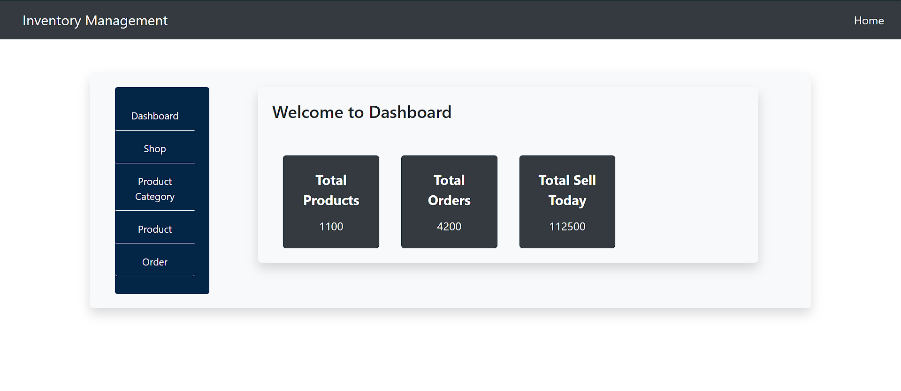
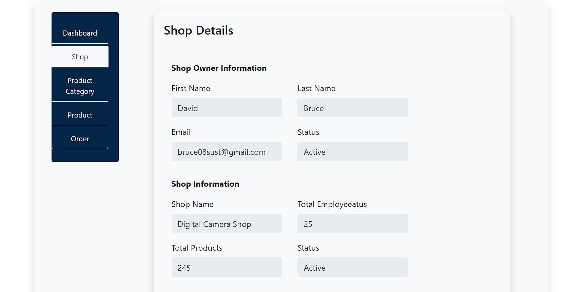
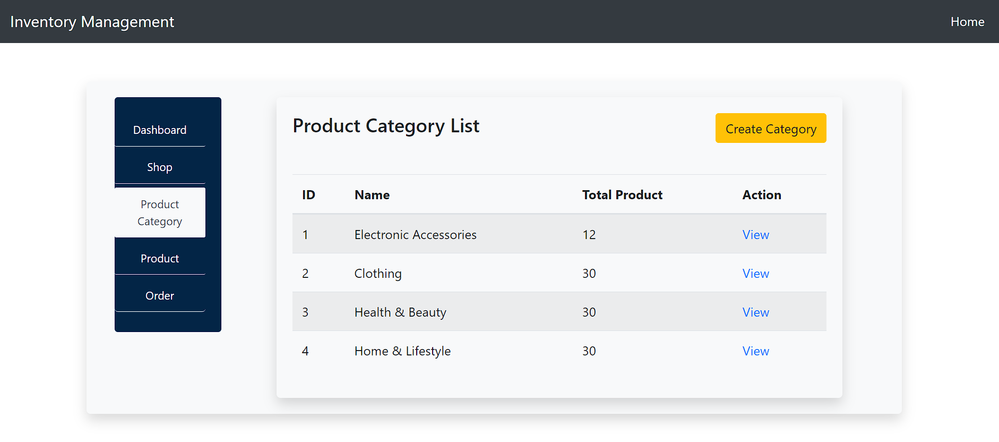
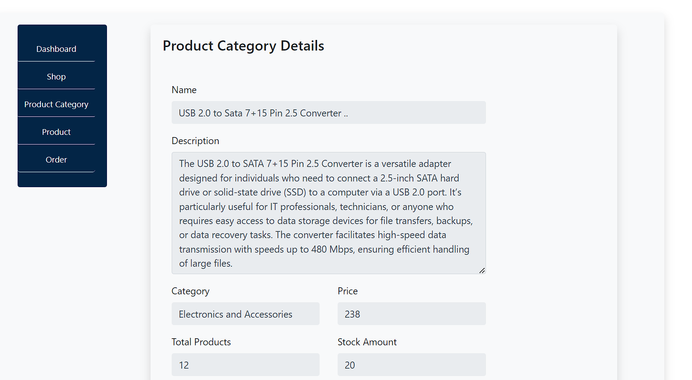
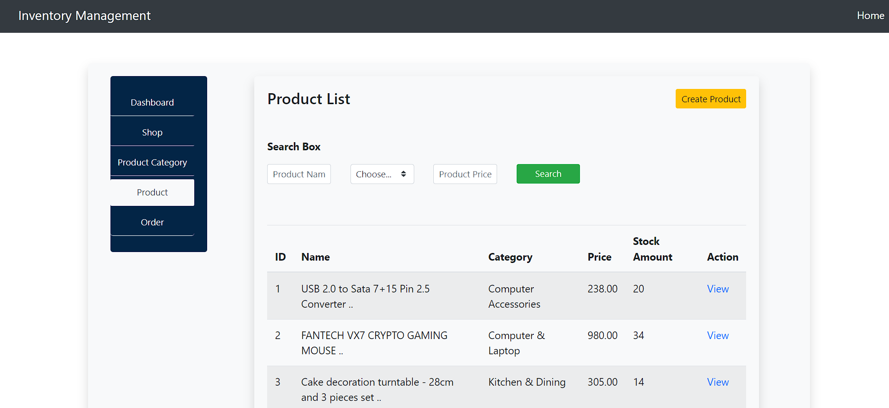
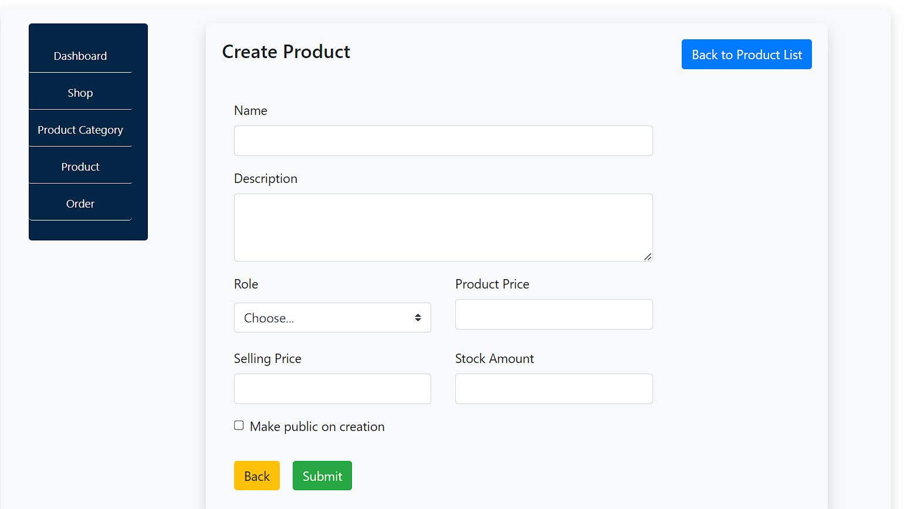
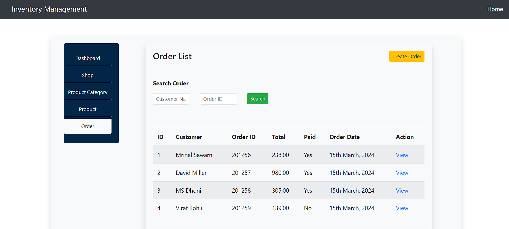
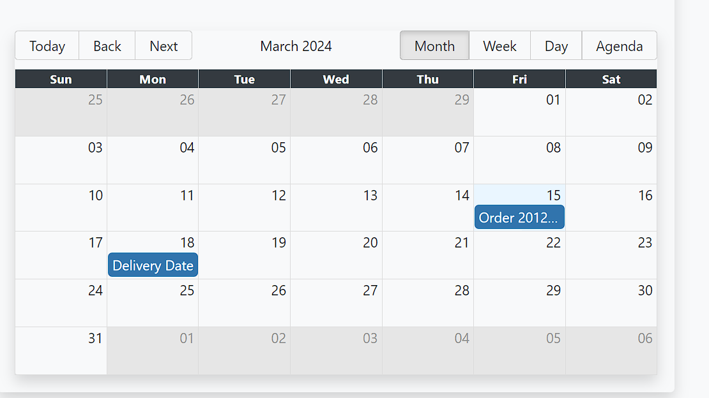

## How to Run and Use the Front-end ERP Application

To run and use the front-end application, follow the steps below:

### Prerequisites

Before getting started, make sure you have the following installed on your machine:

- Node.js: You can download and install Node.js from the official website: https://nodejs.org

### Installation

1. Clone the repository to your local machine using the following command:
    ```
    git clone https://github.com/mrinal526/react-ERP.git
    ```

2. Navigate to the project directory:
    ```
    cd react-ERP
    ```

3. Install the dependencies by running the following command:
    ```
    npm install
    ```

### Starting the Application

To start the application, run the following command:

        npm start

## Usage

After launching the application, you can interact with it using the following features:

- **Dashboard**: The dashboard provides a concise summary of key metrics, including the total number of products, total orders, and total sales for today. It’s designed to give a quick snapshot of daily business performance.


- **Shop Details**: It includes details about the shop and its owner, with editing capabilities for the admin.



- **Product Category**: It displays product categories, each with its name and the total number of products.




- **Product Category Details**: To view the details of a product category, simply click on the "View" link next to the category in the product category list. This action will display information such as the category name, product name, total number of products, price and description.



- **Product**: The product tab displays a list of items, including their available quantity and pricing.



- **Add product**: The product owner can add new items by clicking the "Create Product" button and entering the necessary information.



- **Order**: The order tab provides a concise list of customer orders, detailing the order status and date for each entry.



- **Create Order**: The owner has the ability to both view orders and add new ones using the “Create Order” button.


- **Order Details**: The Order details of customer will be shown here. This page contains the information of customer and their order, owner can also change the status of payment of order.


- **Calendar View**: The calendar feature details order and expected delivery dates, and allows the owner to schedule new events.




## Additional Notes

- For production deployment, build the application using `npm run build` and deploy the generated files to a web server.

## Troubleshooting

If you encounter any issues while setting up or running the application, refer to the following troubleshooting steps:

1. **Check Prerequisites**: Ensure that you have installed Node.js, npm, and a compatible web browser.
2. **Verify Installation**: Double-check that all dependencies are installed correctly by running `npm install` again.
3. **Review Console Logs**: Inspect the browser's developer console for any error messages or warnings.
4. **Search Documentation**: Look for solutions in the project's documentation or online resources.
5. **Ask for Help**: If the issue persists, seek assistance from colleagues or online communities.

## Feedback and Support

For any feedback, suggestions, or issues with the front-end application, please submit a pull request. We appreciate your input and will respond to your inquiries promptly.

## Deployment
**The App is deployed on Netlify**
Here is the link:
https://65f49556a4d56516e16a2d00--friendly-kheer-12bb5c.netlify.app/

